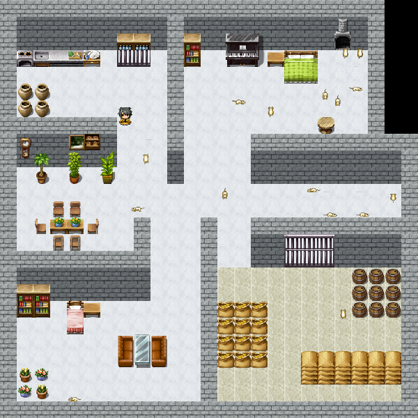

# MouseTraps
Mouse Traps is a progressive level arcade game were mice and other vermin walk around a maze with the objective of reproducing to the point of world conquest. Your job as the player is too kill as many pests, with as few traps, as possible in order to prevent the fall of mankind.


Rendered version of this markdown: [[https://github.com/TrapGameStudio/MouseTraps/blob/master/report.md]]

- Team Name: Trap Game Studio
- Project Name: Mouse Trap
- Team Member:
  - Mohammad Akbor Sherif
  -	(Leo) Yulin Li
  -	Braden McCarthy
  -	Pedro Damian Sanchez Jr

## Implementation Features

### App / GlutApp

Beside one single refresh loop, calls from listeners to member functions of `Game`, a small improvement to let the game scene maintain its aspect ratio when the window is resized, there is no logic implemented in App or GlutApp, which provides a clean entrance for the program.

## Demonstration

### Image

#### Level1 <br>
 <a></a>  <br>
 #### Level2 <br>
 <a></a>   <br>
 #### Level3 <br>
  <a></a> <br>
 
 
## Animation
<a></a>  <br>


### Game

Game listens for screen refresh, key press, and mouse click events from `GlutApp`. However, beside some debugging hotkeys, the Game does not actually have any logic on handling these events; instead, it calls the member functions of `Scene`s, objects holding all shapes and logics associated with those shapes which we will discuss more in the next session, to  do the actual logic.

The Game object has a list to keep track of what scenes it is displaying. The reason we use a list is to allow multiple scene to stack on top of another, such as a game level scene and a game-over overlay scene. This allows a more distributed work load and less downtime on resolving conflicts, since the work of designing, for example, a game-over scene is now totally independent from the designing of the game level. For now, the default scene (we don't have a title scene, so it is the actual game level, and `GameLevel` is a child of `Scene`) is being pushed in the constructor of Game.
```c++
    currentScenes.push_back(std::make_unique<Map02>());
```
When map switching debug hotkey `0`, `-`, `=` is being pressed, the scene queue will be cleared and new scene will be pushed. In the example of `0` hot key, the map will be changed to Map01.
```c++
if (key == '0') {
    currentScenes.clear();
    currentScenes.push_back(std::make_unique<Map01>());
}
```
Since the scene is being newly constructed, this also works as the reset mechanism for each game level.


### GameLevel

GameLevel is derived from Scene. It keeps track of the map, the player, mice generator, and the mice themselves. It also contains the main game logics, such as collision detection, key press event handling, player movement, and traps dispensing mechanism.

#### Map

Each game level has a map, and each map is composed of multiple map layers. Here is an map layer from `DemoLevel.cpp`.
```c
GameLevel::MapLayer* ground = new GameLevel::MapLayer(this);
ground->mapAddRow(".........................");
ground->mapAddRow(".........................");
ground->mapAddRow(".........................");
ground->mapAddRow("1111111111111111111111111");
ground->mapAddRow("1111111111111111111111111");
ground->mapAddRow("1111111111111111111111111");
ground->mapAddRow("1111121111111111111111111");
ground->mapAddRow("1111111111111111111111111");
ground->mapAddRow("1111111111111111111111111");
ground->mapAddRow("1111111111111111111111111");
ground->mapAddRow("............1............");
ground->mapAddRow(".........................");
ground->mapAddRow(".........................");
ground->mapAddRow(".........................");
ground->addCharTileMapping('.', Tile("Inside_A5.png", 0, 0));
ground->addCharTileMapping('1', Tile("Inside_A5.png", 0, 2));
ground->addCharTileMapping('2', Tile("Inside_A5.png", 0, 11));
addMapLayer(-2, ground);
```
This map layer has 3 tiles, `.` is a black tile to make a black background, `1` is wooden floor, and `2` is the same wooden floor but with a hole. More tile can be defined using the `addCharTileMapping` function, where the first argument is the char representation in the map char matrix, and the second argument is the specific tile that should be drawn when rendering. Tile takes a file name, and the row number and the column number of the tile in the tile set. This use of map char matrix and char tile mapping provides a more visualizable way to create a map and also make it very easy to make changes to the map. In the case of the ground MapLayer, I just need to change some `1` to `2` in order to make a hold on the ground. Last thing about the MapLayer, is the first argument in `addMapLayer`. The `-2` in this case is the z-index of the MapLayer. The game is currently hard coded to not handle collision detection for map with z-index less than 0 and greater than 10, and the map with a lower z-index will be covered by map with a higher z-index. So this groud layer of the map will be drawn under the wall layer, which ahs a z-index of 1, and the character can walk freely on it because it is not subject to collision detection.


#### Player

Currently, the player character has to be constructed on each map. Here is how a player is constructed.
```c++
Entity* character = Entity::builder()
    .ofTexture("Graphics/Characters/Char3.png")
    .ofDirection(Direction::MoveDown)
    .atLocation(-0.6, 0.6)
    .build();

character->setKillFunction([this, character]() {
    character->setSpeed(0.0f);
    character->setTexture("Graphics/Characters/Char3-damaged.png");
});

setPlayerCharacter(character);
pushAnimatedShapeToBack(character);
pushShapeToBack(character);
```
We used the fluent builder design pattern instead of using constructor directly to further improve the readability of the code. However, this made the object less maintainable and extendable due to the return type problem of fluent design. Back to the topic, the first part of this code is building the appearance of the player character. The character is defined to have the texture `"Graphics/Characters/Char3.png"`. The row and column of a character texture is hard coded to take only a 3 * 4 texture, so there is no need to specify in this case. It also defines the character to have a initial direction of down. The `MoveDown` is there instead of `Down` only because of name conflict and we did not have time to deal with namespace. And the location of the character will be at -0.6, 0.6 of window coordinate. Next, we set the call back function on when the player dies. For now, it set the character movement speed to 0, and change the picture to a character laying on the ground. It will be called by the explode function in gameLevel.

#### Mice
Mouse is created by the generator. Each mouse is created by the following code:
```c
Entity* mouse = Entity::builder()
  .ofTexture("Graphics/Characters/whtdragon7.png")
  .ofDirection(Direction::MoveDown)
  .atLocation(x, y)
  .ofStaticFrame(0)
  .build();

// turn mice into bbq charcoal mice when bombed
mouse->setKillFunction([this, mouse]() {
  mouse->setTexture("Graphics/Characters/whtdragon3.png");
  mice.remove(mouse);
  states.erase(mouse);
  level->addTimer(25, [this, mouse]() {
    level->removeShape(mouse);
    level->removeAnimatedShape(mouse);
    killMouse(mouse);
  });
});
```

The building process is similar to the player, but the kill function is a little bit different. The mouse first has its texture changed into a "charcoal" mouse, which is just a mouse with a darker color, and we remove it from the mice list so it will no longer response to movement control. 25 game ticks later, the mouse will be remove from the shape list, and some counter and state will be adjusted for that kill.

The mouse movement is control by its state. Beside direction, we also need to define how many steps the mouse is going to move in that direction. If the mouse is always taking one step to a random direction, it will almost always stay in the same position.

#### Trap Dispensing

The trap in this game, for now, is just a bomb. When space bar is pressed, a bomb object will be added to the current position of the player, as defined in the following code.

```c
// make a bomb
TextureRect* bomb = TextureRect::builder()
    .ofTexture("Graphics/Tilesets/SF_Inside_B.png")
    .ofColumnRow(16, 16)
    .ofCurrentColumnRow(15, 0)
    .atLocation(player->getLocation())
    .onAnchor(Anchor::Bottom)
    .ofSize(2.0f / GameConfig::gridColumn, 2.0f / GameConfig::gridRow)
    .build();

removeShape(player);    // remove and readd player to make the player on top of the bomb
pushShapeToBack(bomb);
pushShapeToBack(player);

// bomb exploding in 100 ticks. when explode, remove the bomb,
// create a new Animated Texture Rectangle for the explosion,
// and after explosion, remove explosion texture rectangle.
addTimer(100, [this, bomb]() {
    TextureRect* explosion = TextureRect::builder()
        .ofTexture("Graphics/Animations/Fire2.png")
        .ofColumnRow(7, 1)
        .ofTextureType(TextureType::Animation)
        .ofSize(6.0f / GameConfig::gridColumn, 6.0f / GameConfig::gridRow)
        .atLocation(bomb->getAnchorLocation())
        .onAnchor(Anchor::Bottom)
        .build();

    // actual logic of the explosion
    explode(bomb->getAnchorLocation()->getX(), bomb->getAnchorLocation()->getY());

    pushShapeToBack(explosion);
    pushAnimatedShapeToBack(explosion);
    removeShape(bomb);

    addTimer(10, [this, explosion]() {
        removeShape(explosion);
        removeAnimatedShape(explosion);
    });
});
```
There isn't a dedicated class for the bomb object. It is just a general Texture Rectangle with logic added to timers. The `ofColumnRow` in the TextureRect Builder means the number of column and number of row the texture has, and the `ofCurrentColumnRow` means which tile should be use in the tile set, in this case, it is the one in 15 column and 0 row. The bomb is designed to be set off after 100 game ticks, and after that the bomb texture will be removed, and a texture rectangle of explosion will be added to the same spot. After the animation is done (it is a little bit longer in the code, which is 10 ticks, while 7 should be enough), the explosion will also be remove from the drawing queue.


# FAQ
## failed to open file for reading on Visual Studio
Because the working directory is in the visualc15 folder, you need to create a junction to link ../Graphics to Graphics in the visualc15 folder. Try doing
```
mklink /J Graphics ../Graphics
```
in cmd in the visualc15 folder, and it should fix the problem.
